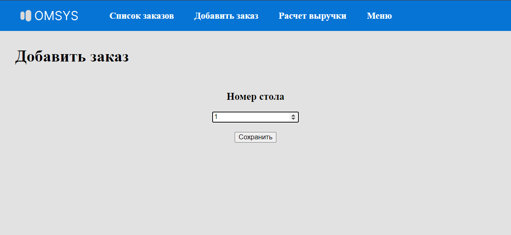

# OMSYS Order Management System

<p style="text-align: center;">
<br>Рисунок 1. Логотип
</p>
Система предназначена для управления заказами в кафе.

Стек: Python 3.10+, Django 4.2

## Содержание
  - [Установка](#установка)
    - [Ubuntu](#ubuntu)
  - [Использование приложения](#использование-приложения)
    - [1. Добавить заказ](#1-добавить-заказ)
    - [2. Удаление заказов](#2-удаление-заказов)
    - [3. Поиск заказа](#3-поиск-заказа)
    - [4. Просмотр заказов](#4-просмотр-заказов)
    - [5. Изменение статуса заказа](#5-изменение-статуса-заказа)
    - [6. Расчет выручки за смену](#6-расчет-выручки-за-смену)
## Установка
### Ubuntu
1. Создание и активация виртуального окружения
```bash
python3 -m venv venv
source venv/bin/activate
```
1. Клонирование репозитория
```bash
git clone git@github.com:osman-miskhodzhev/omsys.git
cd omsys
```
1. Установка зависимостей
```bash
pip install -r requairements.txt
```
1. Запуск
```bash
python3 manage.py runserver
```

## Использование приложения
### 1. Добавить заказ
Для того чтобы добавить заказ, необходимо перейти во страницу "Добавить заказ", в которой необходимо ввести номер стола, нажать кнопку "Сохранить". Далее должна пройзойти переадресация на страницу добавления пунктов заказа.
<p style="text-align: center;">
<br>Рисунок 3. Ввод номера стола
</p>

Для добавления пунктов заказа необходимо в выпадающем списке выбрать нужное блюдо, указать количество и нажать на кнопку "Добавить". Процедуру можно повтарять несколько раз. При указании двух одинаковых блюд количество увеличивается автоматически. Элементы заказа отображаются внизу. Когда заказ сформирован, необходимо нажать на кнопку "Сохранить" 

<p style="text-align: center;">
<br>Рисунок 4. Добавление пунктов заказа
</p>

По нажатии на кнопку "Сохранить" должна пройзойти переадресация на страницу с таблицей заказов.

<p style="text-align: center;">
<br>Рисунок 4. Добавление пунктов заказа
</p>

### 2. Удаление заказов
Для того чтобы удалить заказ необходимо в колонке "Операция" найти необходимый заказ и нажать на ссылку для удаления с надписью "Удалить"

<p style="text-align: center;">
<br>Рисунок 8. Удалить
</p>

### 3. Поиск заказа
Поиск заказа в приложении осуществляется по номеру стола или статусу через поисковую строку, которая располагается сверху таблицы с заказами.

<p style="text-align: center;">
<br>Рисунок 9. Строка поиска
</p>

<p style="text-align: center;">
<br>Рисунок 10. Таблица со всеми заказами
</p>

<p style="text-align: center;">
<br>Рисунок 11. Результат поиска по статусу - approved
</p>

### 4. Просмотр заказов
Для просмотра заказов необходимо перейти на вкладку "Список заказов". Список заказов реализован в виде таблицы, отражающей основную информацию о заказе, включая элементы заказа. 
<p style="text-align: center;">
<br>Рисунок 2. Страница со списком заказов
</p>

### 5. Изменение статуса заказа
При создании заказа ему автоматически задается статус "pending"
Всего в системе у статуса может быть 3 статуса
1. pending
2. approved
3. cancelled

Для того чтобы последовательно изменять стату заказа, под отобажением текущего статуса расположена кнопка, по нажатии на которую статус меняется на следующий
<p style="text-align: center;">
<br>Рисунок 5. Статус заказа "pending"
</p>

<p style="text-align: center;">
<br>Рисунок 6. Статус заказа "pending"
</p>
При отображении последнего статуса кнопка пропадает.

<p style="text-align: center;">
<br>Рисунок 7. Статус заказа "pending"
</p>

### 6. Расчет выручки за смену
Для того чтобы расчитать выручку за смену необходимо перейти на страницу "Расчет выручки"

<p style="text-align: center;">
<br>Рисунок 12. Страница для расчета выручки за смену
</p>

Далее необходимо выбрать время начала смены и время конца смены и нажать на кнопку с надписью "Расчитать". Расчет выручки производится по заказам созданным в заданый временной промежуток и со статусом "cancelled"

<p style="text-align: center;">
<br>Рисунок 13. Результат расчета выручки
</p>

Результат состоит из количества заказов и общей суммы всех заказов.
